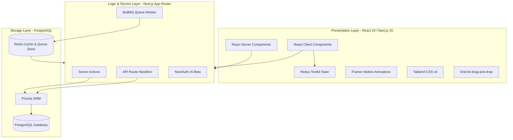
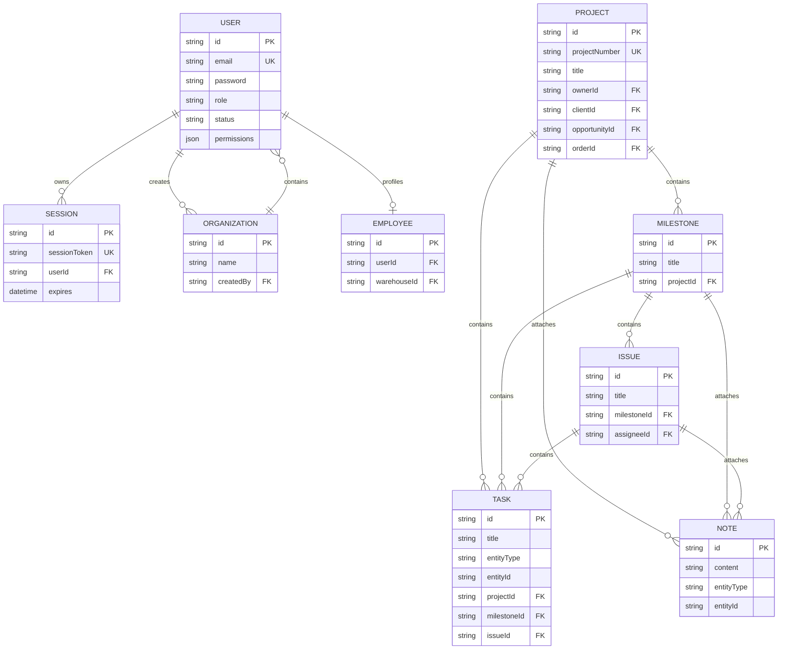
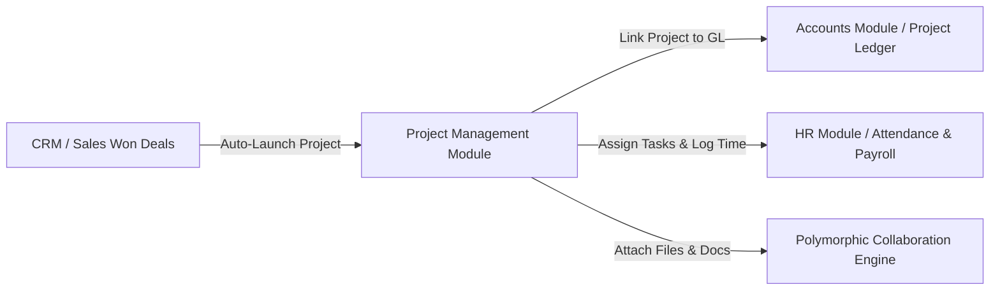

# TS-CRM ERP System: Complete Architectural & Technical Analysis
**Prepared by:** Senior Software Architect & ERP Solution Engineer  
**Date:** May 2026  
**Context Workspace:** `manishankarvakta/ts-crm`

---

## Executive Summary
This document provides a highly detailed, professional, and comprehensive architectural analysis of the **TS-CRM ERP** ecosystem. The codebase represents a highly sophisticated, modern SaaS ERP application built on Next.js 16 (App Router), React 19, Tailwind CSS v4, and Prisma + PostgreSQL. The architecture features cutting-edge patterns such as hybrid database-session tracking (NextAuth credentials with force logout), polymorphic timeline-activity auditing, granular role-based access controls (RBAC) with user-level overrides, and a robust biometric integrations framework in the HR module. 

---

## 1. System Technology Stack



### 1.1 Core Architecture Patterns
- **Next.js App Router Framework**: Standardized around React Server Components (RSC) for data fetching and layout structure, with targeted React Client Components (RCC) for dynamic client-side forms, dashboards, and interactive canvases (e.g. `MissionRoadmapPlanner`).
- **Server-Centric Operations (Server Actions)**: Data mutation and business workflows are primarily handled through Next.js Server Actions (located in `app/actions/*`). This approach bypasses standard REST endpoint overhead, ensuring compile-time TypeScript type safety between client components and backend transactions.
- **Micro-Frontend Modular Separation**: Frontend directories are structured symmetrically to backend models (e.g. `components/projects`, `app/actions/projects`, `app/(dashboard)/dashboard/projects`).
- **Distributed Background Job Processing**: Heavy operational activities (e.g. database backup zip generation, biometric device polling, email queueing) run asynchronously using **BullMQ** backed by **Redis**, ensuring main thread operations remain snappy and unaffected by high latency calculations.

---

## 2. Module Detection Matrix
The system features a deeply modular architecture. By inspecting the system navigation boundaries, permission configurations, and routing systems, the following modules are automatically detected:

| Module | Identifier | Core Purpose | Sub-Modules / Pages | Key Database Entities |
| :--- | :--- | :--- | :--- | :--- |
| **Dashboard** | `dashboard` | Global operational rollup | Main Dashboard Overview | `UserLog`, `Activity`, `Analytics` |
| **CRM & Sales Pipeline** | `crm` | Customer acquisition & tracking | CRM Dashboard, Leads, Opportunities, Contacts, Client accounts, Activities Timeline | `Lead`, `Opportunity`, `Client`, `Contact`, `Activity` |
| **Service Catalog** | `items` | Product & Service offerings | Services, Groups, Categories, Units | `Item`, `ItemCategory`, `ItemGroup`, `Unit` |
| **Quotations & Proposals** | `quotations` | Custom proposal formulation | Quotation Builder, Sales Orders, Delivery Schedules, Client Invoices | `Quotation`, `Section`, `QuotationTerms`, `Order`, `OrderItem`, `Invoice`, `InvoiceItem` |
| **Purchases** | `purchases` | Supply chain procurement | Vendor Purchases, Supplier Catalog | `Purchase`, `PurchaseItem`, `Supplier` |
| **Accounts & General Ledger** | `accounts` | Double-entry financial audit | Chart of Accounts, Ledgers, Cash/Bank Accounts, Vouchers, Financial Statements (Trial Balance, Balance Sheet, Profit & Loss) | `ChartOfAccount`, `JournalEntry`, `JournalEntryLine`, `Voucher`, `VoucherLine`, `CashBankAccount` |
| **Peoples** | `peoples` | Unified actor profile directory | Users, Customer Profiles, Supplier Profiles, Employee Profiles | `User`, `Client`, `Supplier`, `Employee` |
| **Work Orders & Deliveries** | `work-orders` | Fulfillment & log operations | Active Work Orders, Delivery Ledger | `Delivery`, `DeliveryLedger`, `DeliverySchedule`, `DeliveryScheduleItem` |
| **HR & Payroll** | `hr` | Human resource lifecycles | Attendance Logs, Shifts parameters, Holidays catalog, Leave Applications, Employee Loans, Payroll generation, Biometric settings | `Employee`, `Attendance`, `AttendanceLog`, `BiometricDevice`, `BiometricSyncLog`, `Shift`, `LeaveType`, `LeaveApplication`, `EmployeeLoan`, `EmployeeSalary`, `Payroll`, `PayrollItem`, `Overtime`, `Holiday` |
| **System Collaboration** | `collaboration` | Polymorphic generic helpers | Docs database, Task allocation, Notes dashboard, Files and media storage | `Doc`, `Task`, `Note`, `File`, `EntityFileLink` |

---

## 3. Database & Entity Relationship Breakdown (ERD)

The PostgreSQL database is managed via Prisma. The schema features standard foreign key relations layered with highly flexible polymorphic modeling.



### 3.1 Key Schema Strengths
1. **Polymorphic Collaboration Engine**: Models like `Task`, `Note`, and `Doc` use a dual relational mechanism. They include direct, optional foreign keys (`projectId`, `milestoneId`, `issueId`, `leadId`, etc.) for strict integrity, alongside polymorphic string pairs (`entityType` and `entityId`) for flexible, dynamic event attachment.
2. **Specialized Financial Structure**: Financial tables enforce dual-entry constraints:
   - `JournalEntry` contains master-level ledger entries, which are balanced across multiple `JournalEntryLine` records.
   - `Voucher` handles external payments/receipts, containing granular detail within `VoucherLine` records. Both are linked back to specific bank accounts (`CashBankAccount`) and general ledger charts (`ChartOfAccount`).
3. **Biometric Integration Hook**: `AttendanceLog` acts as a high-frequency telemetry sink for hardware devices. It tracks logs to biometric keys through `BiometricDevice` and maps them back to `Employee` records.

---

## 4. Multi-Tenant Strategy Analysis
Unlike standard SaaS multi-tenancy models that isolate customer instances via strict `tenantId` boundaries on all tables, TS-CRM implements an **Internal Legal Entities/Branch Multi-Tenancy Strategy**:

- **System Instance Scope**: The entire server instance represents one enterprise customer ecosystem.
- **Multiple Legal Entities/Branches (`Organization`)**: The enterprise can operate multiple legal companies, branches, or subsidiaries (modeled via the `Organization` table).
- **Transactional Tenant Isolation**: Specific transactional tables (e.g. `Quotation`, `Voucher`, `VoucherLine`, `JournalEntryLine`) possess an `organizationId` foreign key. This allows:
  - Branch-level document customization (e.g. unique logos, letters, and banking terms for quotations issued by subsidiary branches).
  - Isolated branch ledger bookkeeping (allocating financial assets and expenses directly to specific legal units).
- **Global Resource Sharing**: Critical system resources—such as the customer catalog (`Client`), supplier lists (`Supplier`), master service catalogue (`Item`), and staff directory (`User`, `Employee`)—exist globally within the system instance, fostering seamless cross-branch operations and administrative sharing.

---

## 5. Security, RBAC, and Authentication Architecture

```
                               Merged User Permissions
                              /                       \
             [PermissionTemplate]                     [UserPermission]
          (Designation/Role Default)              (Granular User Overrides)
                      |                                       |
                      +-------------------+-------------------+
                                          |
                                          v
                              [getUserPermissionsEnhanced]
                                          |
                                          v
                               Cache Validation (Redis)
                                          |
                        +-----------------+-----------------+
                        |                                   |
                        v                                   v
                 [Page Access Check]             [Operation Verb Validation]
             e.g., crm.leads -> True              e.g., create, view, edit
```

### 5.1 Authentication Mechanism (`lib/auth.ts`)
- Implemented with **NextAuth v5 (Beta)** using a custom Credentials Provider (Email & Password hashing via `bcryptjs`).
- **Database Session Enforcement**: While NextAuth utilizes high-performance JWT tokens by default, the architecture implements a dual-check session tracking database table (`Session`). On initial login, a custom session ID is injected into the JWT. On every server request, NextAuth validates that this session ID still exists in the database.
- **Force Logout Hook**: This hybrid strategy allows administrative staff to instantly log out any user or revoke their credentials by deleting their database session, bypassing long-lived client JWT expiration vulnerabilities.

### 5.2 Granular RBAC (`lib/permissions.ts`)
- **Dual Resolution Engine**: A user's operational permission is evaluated by merging their assigned Designation Template default permissions (`PermissionTemplate`) with specific user-level permission overrides (`UserPermission`). 
- **Enhanced Permission Structure**: The application supports two formats:
  - *Legacy format*: Strings representing authorized operations (e.g., `["create", "read"]`).
  - *Enhanced format*: Detailed key-value maps (`Record<string, PagePermission>`) defining three precise Boolean/array elements:
    - `pageAccess`: Grants absolute visibility to route files.
    - `navigationVisible`: Determines if the module shows in the sidebar.
    - `operations`: Array of allowed action verbs (e.g., `["view", "create", "edit", "move-to-trash", "delete-permanently"]`).
- **Universal Policy Enforcement**: Even system administrators (`role: admin`) are subjected to explicit permissions logic, ensuring security policies are never bypassed.

---

## 6. Dashboard, Analytics, and Events Integration

### 6.1 Unified Event Loop (`lib/system/hooks.ts`)
The ERP features an event-driven framework driven by Server Actions:
1. Operations emit payload definitions via `emitSystemEvent()`.
2. The method triggers double-event routing in a non-blocking way:
   - **Timeline Activity Logger (`lib/system/activity-ledger.ts`)**: Creates a database activity log in the `Activity` table, separating Context (where the event is shown, e.g. Lead or Project) from Subject (what entity was affected).
   - **System Notification Router (`lib/system/notifications.ts`)**: Dynamically triggers in-app notification alerts for affected users or team members.

### 6.2 Aggregations & Metrics Pipeline
- **Dashboard Rollups (`lib/system/analytics-service.ts`)**: Generates real-time KPIs using high-performance database aggregates (e.g., CRM pipeline summation, lead status distribution group-bys, conversion rates).
- **Time-Series Metric Recording (`lib/system/analytics.ts`)**: The `Analytics` model acts as a dedicated log sink for arbitrary analytical variables (e.g., user views, campaign clicks, performance time metrics) tagged with custom dimensions, ready for dashboard reporting.

---

## 7. Reusable Systems & Utilities
The codebase contains highly stable, modular subsystems that must be leveraged for new feature development:
1. **Polymorphic Timeline Logging**: `createActivityRecord` handles unified business audits.
2. **Unified System Notifications**: `createNotification` handles persistent client notification management, backed by the top-bar dynamic client header `NotificationDropdown.tsx`.
3. **Encrypted Security Infrastructure**: Custom database-level backup and encryption engines with validated AES-256-GCM configurations.
4. **General Ledger Financial Integration**: Subsystem to auto-generate transactional double-entry records (vouchers and journal lines) from other modules (such as Quotations, Sales Orders, or payroll payouts).
5. **Drag-and-Drop Canvas Utilities**: Formatted sorting components configured using `@dnd-kit/core` and `@dnd-kit/sortable` (e.g. `MissionRoadmapPlanner`).

---

## 8. Technical Debt & Scalability Risks

### 8.1 Technical Debt
- **Prisma Schema Bloat**: The `schema.prisma` file is extremely large (nearly 2,000 lines). The lack of split schemas makes schema schema compilation and visual mapping complex.
- **Type Conversions and Decimals**: Heavy use of `Decimal` (via `Decimal.js` in Prisma) causes JSON serialization errors in React Server Components. The actions must manually map decimals back to JavaScript numbers (e.g., mapping project budgets in `project.action.ts`), creating potential calculation drift.

### 8.2 Scalability Risks
- **High-Frequency Session Validations**: Validating the database session table (`Session`) on *every single request* via the NextAuth middleware JWT callback creates a database connection bottleneck. Under heavy user loads, this will flood the PostgreSQL connection pool.
- **Synchronous Permission Computations**: Merging template permissions with user-level overrides is done dynamically. Although cached with `unstable_cache` for 1 hour, updates or cache misses force heavy query lookups on nested JSON attributes, which degrade database performance over time.

---

## 9. Recommended Integration Strategy for New Project Management Module
To integrate a premium **Project Portfolio Management (PPM)** module, we should leverage the existing model stubs while building out comprehensive cross-departmental features:



### 9.1 Database Evolution Plan
Extend the existing Project models to support deep integrations:
- **Timesheets Table**: Capture dynamic hours logged against a Project, Milestone, or Task, directly tying into HR attendance and employee shifts.
- **Project Budget Tracking**: Track project expenses directly by mapping supplier purchase items to a project ID.

### 9.2 Three-Way Integration Architecture

#### A. CRM & Sales Integration
- **Auto-Launch Workflow**: When a Sales Opportunity is marked as `WON` or a `Quotation` is signed off and converted into an `Order`, trigger a system action to auto-generate a new `Project` record.
- **Pre-populate Parameters**: Copy the budget from the sales contract, link the `clientId`, and pre-populate initial Project Milestones from the quotation's custom Pricing and scope Sections.

#### B. Accounting & General Ledger Integration
- **Project Ledger Mapping**: Map project IDs to `JournalEntryLine` and `VoucherLine` models.
- **Project P&L Dashboard**: Aggregate financial vouchers and journal lines associated with a project ID to compute real-time project Profit and Loss (invoiced client payments minus contractor payroll, raw material costs, and vendor purchase order bills).

#### C. HR & Payroll Integration
- **Employee Task Assignment**: Assign staff members (`Employee`) directly to Project tasks or milestones using the assignee key.
- **Timesheet to Payroll Pipeline**: Dynamically pull hours logged on project tasks in a given month, convert them to project salary or bonuses, and inject them directly as `PayrollItem` records during monthly Payroll generation.

---
