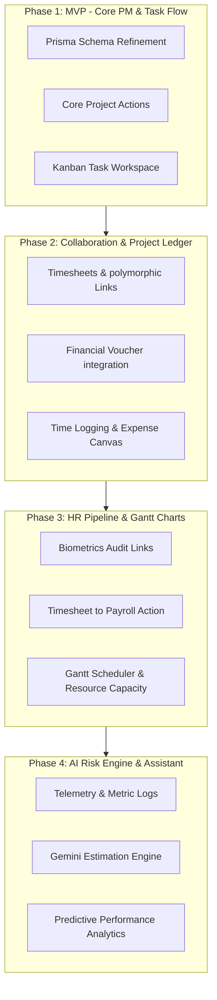

# TS-CRM ERP: Project Management & Team Performance Integration Roadmap
**Prepared by:** Senior Software Architect & ERP Solution Engineer  
**Ecosystem Stack:** Next.js 16 (App Router) | React 19 | Prisma + PostgreSQL | Tailwind CSS v4 | Redux Toolkit | Gemini AI

---

## Roadmap Executive Summary
This document outlines a phased implementation roadmap to evolve the existing codebase of `ts-crm` into a fully integrated, enterprise-grade **Project Portfolio Management (PPM) and Team Performance Module**. The architecture leverages the system's existing polymorphic collaboration engine (Tasks, Notes, Docs, Files), the multi-tenant Organization design, and hooks directly into the General Ledger (Accounts) and HR (Biometrics, Payroll) modules.



---

## PHASE 1: The MVP (Core Project Management & Kanban Boards)
*Goal: Expand and complete the existing baseline project/task structures to deliver a fully operational project tracker with interactive task workflows.*

### 1.1 Database Evolution (Prisma Schema changes)
Modify existing models (`Project`, `Milestone`, `Issue`, `Task`) to ensure comprehensive state representation:

```prisma
// --- prisma/schema.prisma modifications ---

enum ProjectPriority {
  LOW
  NORMAL
  HIGH
  CRITICAL
}

// Modify existing Project model:
// - Ensure projectNumber is auto-generated (e.g., PRJ-2026-0001)
// - Enforce default priority enum type
// - Link default Organization for multi-tenant branch grouping

model Project {
  // Existing fields...
  organizationId   String?
  priority         ProjectPriority  @default(NORMAL)
  
  // Relations
  Organization     Organization?    @relation(fields: [organizationId], references: [id])
  
  @@index([organizationId])
}

// Modify Task model status to support standard Agile cycles
// - Standardize statuses: "TODO", "IN_PROGRESS", "REVIEW", "DONE", "BLOCKED"
```

### 1.2 Backend API & Server Actions (`app/actions/projects/`)
Refactor the current `project.action.ts` to implement strict validations and add new task control flows:
- `getProjectBoard(projectId: string)`: Return milestones, tasks, and issues grouped by workflow columns (`TODO`, `IN_PROGRESS`, `REVIEW`, `DONE`) in a optimized query.
- `updateTaskStatus(taskId: string, status: string, actorId: string)`: Standardize drag-and-drop mutations on the Kanban board.
- **Audit Hook**: Trigger `emitSystemEvent()` on any status changes to update the polymorphic `Activity` timeline automatically.

### 1.3 Frontend Changes (`components/projects/` & `app/(dashboard)`)
- **Main Dashboard Manager (`ProjectManager.tsx`)**: List views featuring advanced status filters, client associations, progress bar meters (calculated as completed vs. total tasks), and budget health tags.
- **Kanban Board Canvas (`ProjectKanbanBoard.tsx`)**: Build an interactive board using `@dnd-kit/core` and `@dnd-kit/sortable` for fluid drag-and-drop operations, utilizing **Framer Motion** for smooth visual transition feedback.
- **Forms**: Implement custom modals for Task, Milestone, and Project creation using `@hookform/resolvers` and `zod` for real-time validation.

### 1.4 Permissions & RBAC Settings
Define standard permission scopes inside `types/permissions.ts` and `lib/permissions.ts`:
- `projects.projects`: Grants access to the main dashboard and personal projects.
- `projects.all`: Allows administrators to view/edit all projects across organizational branches.
- Operations: `["create", "view", "edit", "move-to-trash", "delete-permanently"]`.

---

## PHASE 2: Phase 2 (Collaboration, Financials & Timesheets)
*Goal: Integrate project execution with the double-entry accounting ledger and introduce employee timesheet tracking.*

### 2.1 Database Evolution
Create the new structural models for tracking timesheets and connecting external files:

```prisma
// --- New Timesheet Table ---
model Timesheet {
  id           String      @id @default(cuid())
  employeeId   String
  projectId    String
  taskId       String?
  date         DateTime    @db.Date
  hours        Decimal     @db.Decimal(5, 2)
  description  String?
  billable     Boolean     @default(true)
  status       String      @default("DRAFT") // DRAFT, SUBMITTED, APPROVED, REJECTED
  approvedBy   String?
  createdAt    DateTime    @default(now())
  updatedAt    DateTime    @updatedAt
  
  // Relations
  Employee     Employee    @relation(fields: [employeeId], references: [id], onDelete: Cascade)
  Project      Project     @relation(fields: [projectId], references: [id], onDelete: Cascade)
  Task         Task?       @relation(fields: [taskId], references: [id])
  Approver     User?       @relation("TimesheetApprover", fields: [approvedBy], references: [id])

  @@index([employeeId])
  @@index([projectId])
  @@index([date])
  @@index([status])
}

// Ensure VoucherLine and JournalEntryLine have:
// projectId   String?
// Project     Project?   @relation(fields: [projectId], references: [id])
```

### 2.2 Backend API & Server Actions
- **Timesheet Management Actions (`app/actions/projects/timesheets.ts`)**:
  - `submitTimesheet(input)`: Action to record hours.
  - `approveTimesheet(id, approverId)`: Transition status to `APPROVED`.
- **Accounting Integration Action (`app/actions/projects/accounting.ts`)**:
  - `getProjectFinancialSummary(projectId: string)`: Sum all matched `VoucherLine` (representing cash inputs/expenses) and `JournalEntryLine` records matching the `projectId` to calculate budget burn rate and dynamic profitability margin.

### 2.3 Frontend & UI Sub-Modules
- **Timesheet Logger View (`components/projects/TimesheetConsole.tsx`)**: Simple weekly grid view allowing staff to log daily work hours against allocated tasks.
- **Financial Analytics Panel (`components/projects/BudgetAnalytics.tsx`)**: Recharts integration showing a split progress bar: *Budgeted Expenses vs. Actual Expenses* (derived from general ledger entries) and *Invoiced Client Revenue*.
- **Polymorphic Media Selector**: Integrate `MediaSelector.tsx` and `UploadDialog.tsx` directly into task/milestone forms to link files (proposals, design assets) to the project through `EntityFileLink`.

### 2.4 Permissions Configuration
Extend RBAC settings:
- `projects.timesheets`: Grant `create`/`view`/`edit` for personal time logs.
- `projects.budgets`: Control access to the project financial/budget tracking metrics (restricted to project managers and administrators).

---

## PHASE 3: The Enterprise Phase (HR Sync, Interactive Gantt & Capacity Plan)
*Goal: Bridge project telemetry with the HR module (attendance verification, biometric audits, and payroll processing) and implement advanced scheduling tools.*

```
                 Staff Timesheet Logged (Weekly)
                              |
                              v
                 Biometric Log Cross-Reference
             (Ensures employee was checked in on date)
                              |
                              v
                  Manager Approval Loop
                              |
                              v
                Timesheet Payout Action
                              |
                              v
         Injected directly into monthly PayrollItem
          (As Project Bonus or Direct Hourly Rate)
```

### 3.1 Database Evolution
Ensure direct links are established between biometric devices, attendance records, and timesheets:

```prisma
// Extend Attendance model to references timesheet audits
model Attendance {
  // Existing fields...
  timesheetVerified Boolean @default(false)
}
```

### 3.2 Advanced Backend Integrations (HR & Payroll Action Hooks)
- **Attendance Biometric Audit Check**: When a timesheet is submitted, trigger an automated validator action `auditTimesheetAttendance(timesheetId)` that cross-references the logged date against `AttendanceLog` (synced via biometric devices) to verify the employee was physically present.
- **Automated Payroll Pipeline Action (`app/actions/hr/payroll-bridge.ts`)**:
  - Triggered during the monthly generating action of `generateMonthlyPayroll(month, year)`.
  - Aggregates all `APPROVED` billable project `Timesheet` records for each staff member.
  - Computes timesheet salary (hours multiplied by the billable rate defined in `EmployeeSalary`).
  - Automatically injects this calculated amount into the corresponding `PayrollItem` gross pay as a project bonus or hourly wage component.

### 3.3 Advanced Frontend Engine (`components/projects/gantt/`)
- **Interactive Project Gantt Chart (`ProjectGantt.tsx`)**: SVG/Canvas-based timeline visualizing milestones and tasks. Supports dynamic mouse dragging to adjust start/end dates, triggering instant updates in `project.action.ts`.
- **Resource Allocation and Capacity Planner (`ResourceCapacityPlanner.tsx`)**: Recharts-based matrix plotting team members against allocated hours per project, highlighting over-allocated resources with visual warning alerts.

---

## PHASE 4: The AI Phase (Gemini Analytics, Auto-Scheduling & Predictive Risks)
*Goal: Harness the system's Gemini AI capabilities (shared AI package infrastructure) to deliver automated insights, smart estimations, and predictive project metrics.*

### 4.1 AI Engine Integration Architecture (`lib/ai/`)
Utilize the established `GeminiProvider` to route project metadata arrays (historical project speeds, task volumes, team allocations) for AI analytics.

```
       Project Metadata + Historical Tasks
                       |
                       v
         Gemini Inference Analysis Loop
                       |
        +--------------+--------------+
        |                             |
        v                             v
[Predictive Risk Analyzer]    [Auto-Schedule Optimizer]
 - Identifies bottlenecks      - Calculates optimal paths
 - Flag delays in milestones   - Balances resource capacity
```

### 4.2 Core AI Services (`lib/ai/project-analytics.ts`)

#### A. Smart Project Estimation Engine
- **Service API**: `generateAIEstimation(projectDraftText: string)`
- **Workflow**: Analyzing raw project scope text or proposal documents, the Gemini AI service automatically generates:
  - Recommended Project Milestones.
  - A structured list of required Tasks with baseline durations.
  - Predicted task priorities and optimal sequence order.

#### B. Predictive Risk and Delay Engine
- **Service API**: `predictProjectRisks(projectId: string)`
- **Workflow**: Gemini evaluates current task velocities, over-allocation metrics, historical employee timesheets, and biometric attendance consistency to predict:
  - Estimated project completion delay (in days).
  - High-risk milestones (e.g. milestones with high probability of missing due dates).
  - Smart resource re-routing suggestions (e.g., "Re-assign Task X from User A to User B to prevent a 4-day bottleneck").

### 4.3 Frontend AI Dashboards (`components/projects/ai/`)
- **AI Project Assistant Console (`AIAssistantConsole.tsx`)**: Dynamic chat panel enabling project managers to ask contextual questions (e.g., *"How is our budget burn rate looking for Project X, and where are the bottlenecks?"*).
- **Predictive Risk Panel (`PredictiveRiskPanel.tsx`)**: Sleek dashboard rendering visual metrics, including:
  - *Confidence Scores* for meeting project deadlines (rendered in green/yellow/red).
  - *Risk alerts* featuring automated actions to automatically re-balance resources or notify key clients.

---

## Technical Feasibility & Execution Summary

| Phase | Duration | Core Frontend Components | Core Database / API Targets | Risk Profile |
| :--- | :--- | :--- | :--- | :--- |
| **MVP** | 2-3 Weeks | `ProjectManager.tsx`, `ProjectKanbanBoard.tsx`, forms modals | Refactored `project.action.ts`, standardized enum transitions | **Low**: Employs existing model stubs without database structural migrations. |
| **Phase 2** | 3 Weeks | `TimesheetConsole.tsx`, `BudgetAnalytics.tsx`, TipTap markdown docs | New `Timesheet` table, `projectId` mappings in GL Ledgers | **Medium**: Requires running database migrations to alter core accounting models. |
| **Enterprise** | 4 Weeks | `ProjectGantt.tsx`, `ResourceCapacityPlanner.tsx`, Payroll panels | Automated Payroll-Timesheet bridge, Biometric audits check | **High**: Cross-module integration with payroll and biometrics requires extensive transaction safety checks. |
| **AI Phase** | 2 Weeks | `AIAssistantConsole.tsx`, `PredictiveRiskPanel.tsx` | `GeminiProvider` integration, prompt vector builders | **Medium**: Relies on data completeness in timesheets for accurate estimations. |

---
