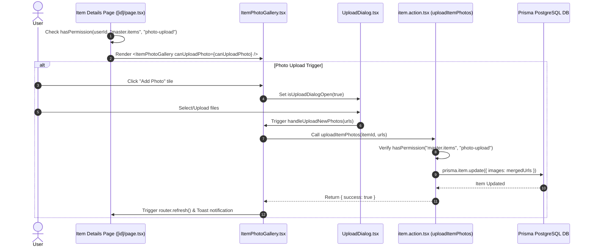

# 📘 Developer Documentation: Item Photos Gallery UI & Photo Upload Permission

This document provides a technical guide, architecture breakdown, and implementation details for the **Item Photos Gallery UI Upgrade** and the independent **Photo Upload Permission** system in **ffERP** (`startup-mvp`).

---

## 🎯 1. Technical Overview

The Item Details view page (`/dashboard/master/items/[id]`) has been upgraded from a static, vertically stacked image list to an interactive, compact **Hero Showcase Gallery** featuring a **Thumbnail Ribbon**, an in-place **Upload Tile**, and a full-screen **Slidable Lightbox Modal**.

Additionally, a dedicated permission operation `photo-upload` was introduced under the `master.items` permission module, ensuring strict access control for photo upload capabilities across the system.

---

## 🔒 2. Permission System Integration

### Permission Key & Operations
- **Module Permission Key**: `master.items`
- **Operation Key**: `photo-upload`
- **Navigation Structure Entry** ([`types/permissions.ts`](file:///Users/manishankarvakta/Desktop/APPS/ffERP/startup-mvp/types/permissions.ts)):
  ```typescript
  export type CustomOperation =
    | ...
    | "photo-upload";

  // Registered in NAVIGATION_STRUCTURE under master.items:
  operations: ["create", "view", "edit", "photo-upload", "move-to-trash", "delete-permanently"]
  ```

### Strict Permission Evaluation Rule
To prevent permission leakage, `photo-upload` operates **strictly independent** of the `edit` permission. 
- Having `edit` permission does **NOT** grant photo upload rights if `photo-upload` is unchecked in the role/permission matrix.

```typescript
// Server Page Evaluation (app/(dashboard)/dashboard/master/items/[id]/page.tsx)
const canUploadPhoto = userId ? await hasPermission(userId, "master.items", "photo-upload") : false;
```

---

## ⚡ 3. Backend Server Action Architecture

### `uploadItemPhotos` ([`item.action.tsx`](file:///Users/manishankarvakta/Desktop/APPS/ffERP/startup-mvp/app/%28dashboard%29/dashboard/master/items/_actions/item.action.tsx))

This server action appends newly uploaded photo URLs to an item's catalog image list.

#### **Signature**:
```typescript
export async function uploadItemPhotos(
  itemId: string,
  newImageUrls: string[]
): Promise<{ success: boolean; item?: any; error?: string }>
```

#### **Execution Steps**:
1. **Authentication Check**: Resolves `auth()` session.
2. **Permission Guard**: Verifies `await hasPermission(session.user.id, "master.items", "photo-upload")`. Returns 403 error if denied.
3. **Database Fetch**: Queries target `Item` record via Prisma.
4. **Deduplication & Merge**: Merges current `images` array with `newImageUrls` using `Set` to prevent duplicate entries.
5. **Featured Image Fallback**: Automatically sets `featuredImage` to `updatedImages[0]` if `featuredImage` was previously `null`.
6. **Audit & Revalidation**: Logs user activity via `logItemUpdated` and invalidates Next.js router cache via `revalidateBothPaths("master/items")`.

---

## 🎨 4. Frontend Component Architecture

### Component Hierarchy
```
app/(dashboard)/dashboard/master/items/[id]/page.tsx (Server Component)
 └── ItemPhotoGallery.tsx (Client Component)
      ├── Main Hero Box (aspect-[4/3] + hover zoom + FEATURED badge)
      ├── Thumbnail Ribbon (Grid container)
      │    ├── Existing Photo Thumbnails (aspect-square)
      │    └── Add Photo Tile (+) (Renders AFTER last photo)
      └── Slidable Lightbox Modal (Fullscreen overlay)
           ├── Header (Item Name, Code, Counter X of N, Close button)
           ├── Main Viewer (Prev/Next buttons, Slide Image, Keyboard listener)
           └── Footer Ribbon (Bottom thumbnail strip for 1-click jump)
```

---

### Component Interface (`item-photo-gallery.tsx`)

```typescript
interface ItemPhotoGalleryProps {
  itemId?: string;
  images: string[];
  featuredImage?: string | null;
  itemName: string;
  itemCode?: string;
  canUploadPhoto?: boolean;
}
```

---

### Layout Highlights & UI Fixes

1. **Exact Cell Alignment for "Add Photo" Tile**:
   - The **Add Photo (+)** tile is rendered as an inlined `<button className="aspect-square rounded-lg border-2 border-dashed ...">` inside the `grid grid-cols-4 sm:grid-cols-5 gap-2` ribbon container.
   - It matches the **exact 1:1 aspect ratio, height, and border-radius** of surrounding photo thumbnails.

2. **Dialog Triggering**:
   - Clicking the **Add Photo** tile opens `<UploadDialog />` directly, avoiding outer container padding or label overflows.

3. **Empty State Behavior**:
   - If an item has **0 photos** and `canUploadPhoto` is `true`, a styled empty-state drop card displays with an "Upload Photos" button.
   - If `canUploadPhoto` is `false` and there are **0 photos**, the gallery card hides completely.

4. **Slidable Lightbox Modal**:
   - Fullscreen backdrop (`bg-black/95 backdrop-blur-md`).
   - Handles `ArrowLeft` (Previous), `ArrowRight` (Next), and `Escape` (Close) keyboard shortcuts.

---

## 🔄 5. Data Flow Diagram



---

## 🧪 6. Verification & Maintenance Checklist

| Test Scenario | Expected Result | Verified |
| :--- | :--- | :---: |
| **`photo-upload` Unchecked** | "Add Photo" tile is hidden; upload requests rejected | ✅ |
| **`photo-upload` Checked** | "Add Photo" tile appears after the last thumbnail | ✅ |
| **Thumbnail Grid Sizing** | "Add Photo" tile matches 1:1 size of photo tiles | ✅ |
| **Lightbox Keyboard Nav** | Pressing `←` / `→` slides photos; `Esc` closes modal | ✅ |
| **0 Photos + Permission** | Displays empty-state card with "Upload Photos" button | ✅ |

---

## 📁 Modified Files Reference

- [`types/permissions.ts`](file:///Users/manishankarvakta/Desktop/APPS/ffERP/startup-mvp/types/permissions.ts)
- [`startup-mvp/app/(dashboard)/dashboard/master/items/_actions/item.action.tsx`](file:///Users/manishankarvakta/Desktop/APPS/ffERP/startup-mvp/app/%28dashboard%29/dashboard/master/items/_actions/item.action.tsx)
- [`startup-mvp/app/(dashboard)/dashboard/master/items/_components/item-photo-gallery.tsx`](file:///Users/manishankarvakta/Desktop/APPS/ffERP/startup-mvp/app/%28dashboard%29/dashboard/master/items/_components/item-photo-gallery.tsx)
- [`startup-mvp/app/(dashboard)/dashboard/master/items/[id]/page.tsx`](file:///Users/manishankarvakta/Desktop/APPS/ffERP/startup-mvp/app/%28dashboard%29/dashboard/master/items/%5Bid%5D/page.tsx)
