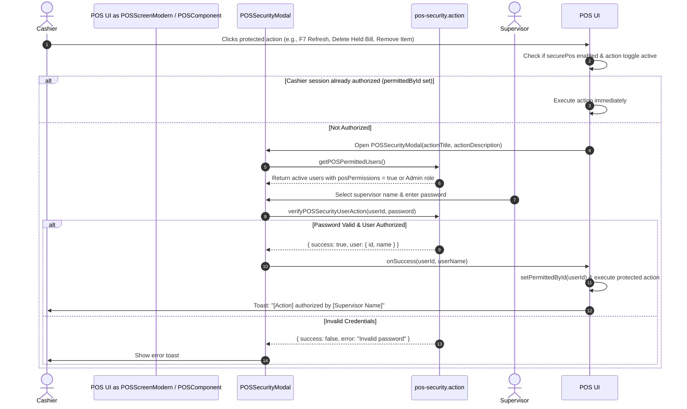

# POS Permissions & Hold System Developer Documentation

## 1. Overview

This document describes the design, implementation, data structures, and workflows for two major Point-of-Sale (POS) features in **ffERP**:

1. **Secure POS Permission Architecture**: Granular permission control guarding sensitive POS operations (Discounts, Coupons, Points Redemption, Due Sales, Item Exchanges, Sales Returns, Due Collections, Screen Refresh, Last Bill Printing, Hold Bill Deletion, and Cart Item Removal) via supervisor PIN/password verification.
2. **Biller-Scoped Held Sales Database Persistence**: Multi-device database storage for held POS sales scoped to individual billers (`User`), enabling seamless transaction state recovery across logouts, session timeouts, and browser reloads.

---

## 2. Secure POS Permission Architecture

### 2.1 Schema & Settings Definitions (`pos-settings.types.ts`)

All POS configuration flags are validated using Zod in [`app/(dashboard)/dashboard/settings/_actions/pos-settings.types.ts`](file:///Users/manishankarvakta/Desktop/APPS/ffERP/startup-mvp/app/%28dashboard%29/dashboard/settings/_actions/pos-settings.types.ts).

```typescript
export const posSettingsSchema = z.object({
  // Master Security Toggle
  securePos: z.boolean().default(false),

  // Granular Permission Controls (Default: true when securePos is active)
  securePosDueSale: z.boolean().default(true),
  securePosDiscount: z.boolean().default(true),
  securePosCoupon: z.boolean().default(true),
  securePosPoints: z.boolean().default(true),
  securePosExchange: z.boolean().default(true),
  securePosReturn: z.boolean().default(true),
  securePosCollectDue: z.boolean().default(true),
  securePosRefresh: z.boolean().default(true),
  securePosLastBill: z.boolean().default(true),
  securePosHoldBillDelete: z.boolean().default(true),
  securePosRemoveItem: z.boolean().default(true),
});
```

### 2.2 Settings UI Configuration (`POSSettings.tsx`)

Located in [`app/(dashboard)/dashboard/settings/_components/POSSettings.tsx`](file:///Users/manishankarvakta/Desktop/APPS/ffERP/startup-mvp/app/%28dashboard%29/dashboard/settings/_components/POSSettings.tsx). When `securePos` is enabled, a clean **2-column responsive grid** (`grid grid-cols-2 gap-4`) displays checkboxes for all granular permissions:

- **Due Sale** (`securePosDueSale`)
- **Discount** (`securePosDiscount`)
- **Coupon** (`securePosCoupon`)
- **Customer Points** (`securePosPoints`)
- **Exchange** (`securePosExchange`)
- **Return** (`securePosReturn`)
- **Collect Due** (`securePosCollectDue`)
- **Refresh** (`securePosRefresh`)
- **Last Bill** (`securePosLastBill`)
- **Hold Bill Delete** (`securePosHoldBillDelete`)
- **Remove Product** (`securePosRemoveItem`)

---

### 2.3 Security Interception Flow

When a cashier attempts a protected action while `securePos: true` and the specific toggle is enabled:



---

## 3. Biller-Scoped Held Sales Database Persistence

### 3.1 Prisma Schema (`schema.prisma`)

Held sales are stored in PostgreSQL using the `POSHeldCart` model in [`prisma/schema.prisma`](file:///Users/manishankarvakta/Desktop/APPS/ffERP/startup-mvp/prisma/schema.prisma):

```prisma
model User {
  id           String        @id @default(cuid())
  // ... other fields
  posHeldCarts POSHeldCart[] @relation("UserPOSHeldCarts")
}

model POSHeldCart {
  id        String   @id @default(cuid())
  userId    String   // Foreign key to User (Biller)
  holdKey   String   // Timestamp or client-side hold identifier
  cart      Json     // Array of CartItem objects (JSON)
  clientId  String?  // Associated Customer ID (if any)
  amount    Float    @default(0) // Grand total amount at time of hold
  createdAt DateTime @default(now())
  updatedAt DateTime @updatedAt

  user User @relation("UserPOSHeldCarts", fields: [userId], references: [id], onDelete: Cascade)

  @@index([userId])
  @@index([holdKey])
}
```

---

### 3.2 Server Actions API (`pos-hold.action.ts`)

Located at [`app/(dashboard)/dashboard/sales/pos/_actions/pos-hold.action.ts`](file:///Users/manishankarvakta/Desktop/APPS/ffERP/startup-mvp/app/%28dashboard%29/dashboard/sales/pos/_actions/pos-hold.action.ts):

| Function | Parameters | Description |
| :--- | :--- | :--- |
| `getHeldCartsAction()` | `none` | Queries `POSHeldCart` table for records matching `session.user.id`, ordered by `createdAt desc`. |
| `saveHeldCartAction(heldCart)` | `POSHeldCartDto` | Creates or updates a `POSHeldCart` entry for `session.user.id` and `holdKey`. |
| `deleteHeldCartAction(holdKey)` | `holdKey: string` | Deletes matching `POSHeldCart` entries for `session.user.id` and `holdKey`. |

```typescript
export interface POSHeldCartDto {
  id: string;
  cart: any[];
  clientId: string;
  amount: number;
}
```

---

### 3.3 Component Lifecycle & Synchronization (`POSComponent.tsx`)

1. **Mount Hydration**:
   ```typescript
   useEffect(() => {
     getHeldCartsAction().then((res) => {
       if (res.success && res.data && res.data.length > 0) {
         setHeldCarts(res.data);
       } else {
         // Fallback to localStorage and sync legacy offline carts to DB
         const saved = localStorage.getItem("pos_held_carts");
         if (saved) {
           try {
             const parsed = JSON.parse(saved);
             setHeldCarts(parsed);
             if (Array.isArray(parsed) && parsed.length > 0) {
               parsed.forEach((hc) => saveHeldCartAction(hc));
             }
           } catch (e) {}
         }
       }
     });
   }, []);
   ```

2. **Holding a Cart (`handleHoldCart`)**:
   - Creates `newHeldCart` object (`id`, `cart`, `clientId`, `amount`).
   - Updates `heldCarts` React state.
   - Invokes `saveHeldCartAction(newHeldCart)` asynchronously to persist in PostgreSQL.
   - Clears active POS screen state (`handleNewSale()`).

3. **Recalling a Cart (`handleRecallCart`)**:
   - Restores items to active cart state.
   - Restores customer selection & wholesale/retail mode parameters.
   - Removes item from `heldCarts` state.
   - Invokes `deleteHeldCartAction(heldCart.id)` to clean up DB record.

4. **Deleting a Held Cart (`onAttemptDeleteHeldCart`)**:
   - Checks `securePosHoldBillDelete` permission via `POSSecurityModal`.
   - Upon authorization, removes item from state and executes `deleteHeldCartAction(id)`.

---

## 4. Developer Verification & Testing

### Database Verification
To verify database synchronization:
```bash
npx prisma db push
```

### Typechecking Verification
To verify all TypeScript types across POS components and server actions:
```bash
npx tsc --noEmit
```

---

## 5. File Index

- [`pos-settings.types.ts`](file:///Users/manishankarvakta/Desktop/APPS/ffERP/startup-mvp/app/%28dashboard%29/dashboard/settings/_actions/pos-settings.types.ts): POS settings Zod schema & defaults.
- [`POSSettings.tsx`](file:///Users/manishankarvakta/Desktop/APPS/ffERP/startup-mvp/app/%28dashboard%29/dashboard/settings/_components/POSSettings.tsx): POS screen settings configuration component.
- [`pos-security.action.ts`](file:///Users/manishankarvakta/Desktop/APPS/ffERP/startup-mvp/app/%28dashboard%29/dashboard/sales/pos/_actions/pos-security.action.ts): Supervisor fetch & password verification server actions.
- [`pos-hold.action.ts`](file:///Users/manishankarvakta/Desktop/APPS/ffERP/startup-mvp/app/%28dashboard%29/dashboard/sales/pos/_actions/pos-hold.action.ts): Biller-scoped DB persistence server actions.
- [`POSSecurityModal.tsx`](file:///Users/manishankarvakta/Desktop/APPS/ffERP/startup-mvp/app/%28dashboard%29/dashboard/sales/pos/_components/POSSecurityModal.tsx): Supervisor authorization dialog component.
- [`POSScreenModern.tsx`](file:///Users/manishankarvakta/Desktop/APPS/ffERP/startup-mvp/app/%28dashboard%29/dashboard/sales/pos/_components/POSScreenModern.tsx): Modern POS interface with hotkeys & security action interceptors.
- [`POSComponent.tsx`](file:///Users/manishankarvakta/Desktop/APPS/ffERP/startup-mvp/app/%28dashboard%29/dashboard/sales/pos/_components/POSComponent.tsx): Main POS controller managing held carts lifecycle & database sync.
