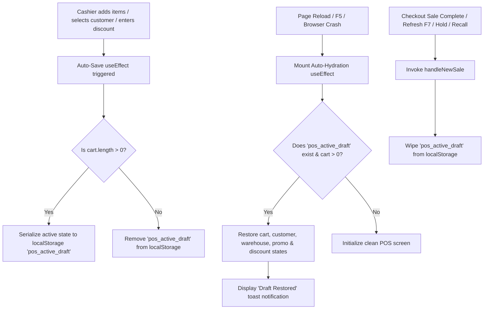

# POS Active Session Draft Auto-Save & Recovery Developer Documentation

## 1. Overview

This document describes the design, implementation, data structure, and lifecycle handlers for the **POS Active Session Draft Auto-Save & Recovery System** in **ffERP**.

### Problem Statement
Previously, when a cashier added products to the active POS cart, selected a customer, applied promo codes, or entered custom discounts, all transaction data was stored exclusively in transient React state. If the browser was reloaded (`F5`), refreshed, or closed, the in-progress transaction was completely lost.

### Solution Architecture
We implemented an **active session draft auto-save and auto-hydration engine** in [`POSComponent.tsx`](file:///Users/manishankarvakta/Desktop/APPS/ffERP/startup-mvp/app/%28dashboard%29/dashboard/sales/pos/_components/POSComponent.tsx). It continuously persists the in-progress session to browser `localStorage` under the key `pos_active_draft` and seamlessly restores it upon page reload.

---

## 2. Active Draft Data Model

The active session draft is serialized as a JSON object with the following TypeScript schema:

```typescript
interface POSActiveDraft {
  cart: CartItem[];            // Array of items in the cart (variants, quantities, line prices)
  selectedClientId: string;    // ID of the selected customer
  selectedWarehouseId: string; // ID of the active warehouse location
  orderType: "RETAIL" | "WHOLESALE"; // Active pricing tier mode
  promoCode: string;           // Entered promo code
  appliedPromo: any;           // Applied promo coupon metadata object
  discountAmount: number;      // Calculated monetary discount amount
  discountType: "FLAT" | "PERCENT"; // Discount type selection
  discountValue: number;       // Raw value entered for discount
  isExchangeMode: boolean;     // Whether item exchange mode is active
  timestamp: number;           // Unix epoch timestamp when draft was last saved
}
```

---

## 3. Workflows & Lifecycle Handlers



### 3.1 Auto-Save Mechanism
A `useEffect` hook monitors changes across all active session variables:

```typescript
useEffect(() => {
  try {
    if (cart.length > 0) {
      localStorage.setItem(
        "pos_active_draft",
        JSON.stringify({
          cart,
          selectedClientId,
          selectedWarehouseId,
          orderType,
          promoCode,
          appliedPromo,
          discountAmount,
          discountType,
          discountValue,
          isExchangeMode,
          timestamp: new Date().getTime(),
        })
      );
    } else {
      localStorage.removeItem("pos_active_draft");
    }
  } catch (e) {
    console.error("Failed to auto-save active draft", e);
  }
}, [
  cart,
  selectedClientId,
  selectedWarehouseId,
  orderType,
  promoCode,
  appliedPromo,
  discountAmount,
  discountType,
  discountValue,
  isExchangeMode,
]);
```

---

### 3.2 Auto-Hydration on Mount
On initial component mount (`useEffect` with empty dependency array `[]`), `POSComponent` checks for an existing `pos_active_draft`:

```typescript
useEffect(() => {
  try {
    const savedDraft = localStorage.getItem("pos_active_draft");
    if (savedDraft) {
      const draft = JSON.parse(savedDraft);
      if (draft && Array.isArray(draft.cart) && draft.cart.length > 0) {
        setCart(draft.cart);
        if (draft.selectedClientId) setSelectedClientId(draft.selectedClientId);
        if (draft.selectedWarehouseId) setSelectedWarehouseId(draft.selectedWarehouseId);
        if (draft.orderType) setOrderType(draft.orderType);
        if (draft.promoCode) setPromoCode(draft.promoCode);
        if (draft.appliedPromo) setAppliedPromo(draft.appliedPromo);
        if (typeof draft.discountAmount === "number") setDiscountAmount(draft.discountAmount);
        if (draft.discountType) setDiscountType(draft.discountType);
        if (typeof draft.discountValue === "number") setDiscountValue(draft.discountValue);
        if (typeof draft.isExchangeMode === "boolean") setIsExchangeMode(draft.isExchangeMode);
        toast({
          title: "Draft Restored",
          description: `Restored ${draft.cart.length} item(s) from your previous session.`,
        });
      }
    }
  } catch (e) {
    console.error("Failed to restore active draft", e);
  }
}, []);
```

---

### 3.3 Draft Cleanup & Reset Triggers
To prevent stale drafts from persisting after a transaction is finished or manually reset, `localStorage.removeItem("pos_active_draft")` is invoked in `handleNewSale()`:

1. **Sale Completion**: When direct billing or modal payment succeeds, `handleNewSale()` is executed.
2. **Screen Refresh (`F7`)**: Clicking **Refresh (F7)** calls `handleNewSale()`, explicitly wiping the active draft.
3. **Cart Hold (`handleHoldCart`)**: Putting a transaction on hold moves it to `POSHeldCart` and clears active draft storage.
4. **Cart Recall (`handleRecallCart`)**: Recalling a held cart clears any previous active draft and loads the recalled transaction.

---

## 4. Verification & Developer Checklist

To test or modify this system:

1. **TypeScript Verification**:
   ```bash
   npx tsc --noEmit
   ```
2. **Reload Recovery Test**:
   - Add items to the cart, choose a customer, and reload the browser page (`F5`).
   - Confirm that the toast `"Draft Restored"` pops up and all cart items and customer selections remain.
3. **Clear Draft Test**:
   - Complete a sale or press `F7` (Refresh).
   - Reload the browser page.
   - Confirm that the POS screen opens completely clean.

---

## 5. File Index

- [`POSComponent.tsx`](file:///Users/manishankarvakta/Desktop/APPS/ffERP/startup-mvp/app/%28dashboard%29/dashboard/sales/pos/_components/POSComponent.tsx): Main POS controller housing active draft auto-save, auto-hydration, and cleanup logic.
- [`POS_PERMISSIONS_AND_HOLD_SYSTEM_DEV_DOCS.md`](file:///Users/manishankarvakta/Desktop/APPS/ffERP/startup-mvp/docs/POS_PERMISSIONS_AND_HOLD_SYSTEM_DEV_DOCS.md): Developer documentation for POS permissions and DB hold persistence.
