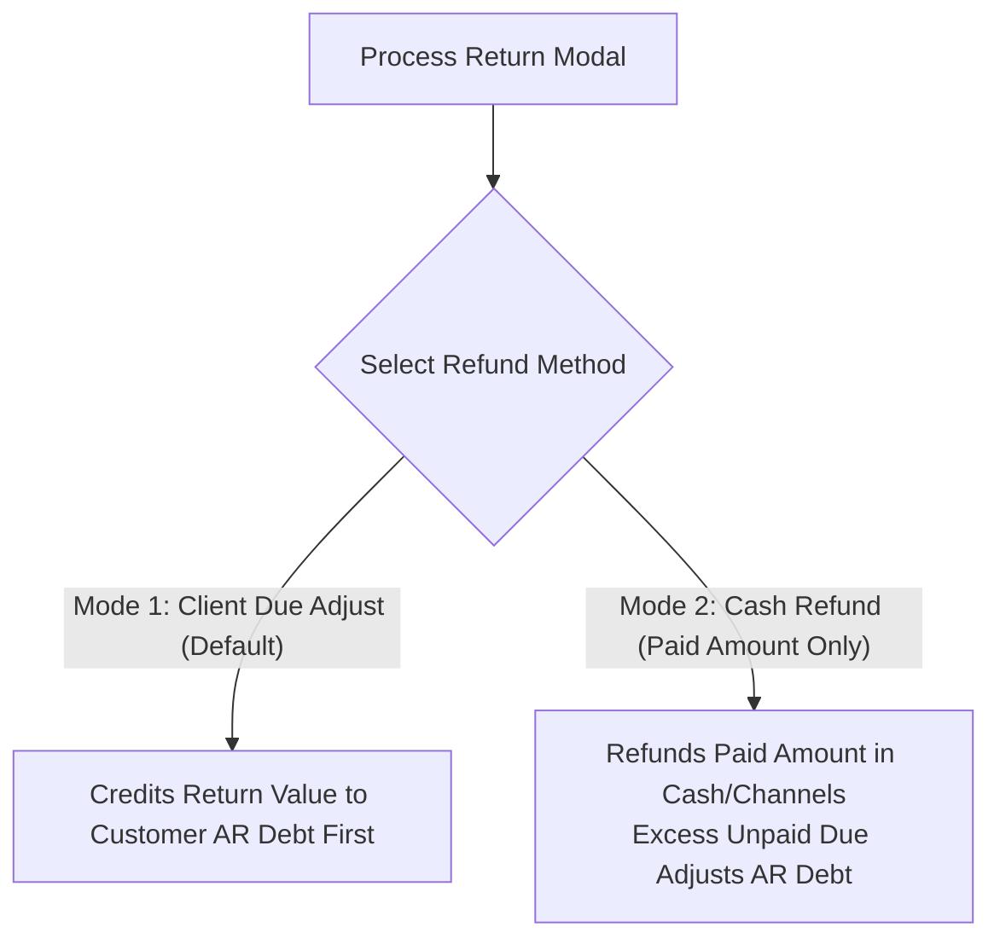

# Sales Return Engine: Architecture, Rules & Operational Manual

**Document Version:** 2.0  
**System Module:** POS & Sales Management (`app/(dashboard)/dashboard/sales/`)  
**Target Audience:** Developers, System Administrators, Accountants, Cashiers  

---

## 📌 1. Overview & Business Requirements

The **Sales Return Engine** in ffERP manages sales returns, customer refunds, inventory restocking, and General Ledger (GL) postings. It handles returns for **Retail**, **Wholesale**, **Ready Product**, and **POS** transactions while guaranteeing double-entry accounting integrity and store cash flow protection.

---

## 🎯 2. Core Operating Rules & Capabilities

### Rule 1: Proportional Discount & Revenue Balancing
When an item is returned from a discounted invoice, the engine calculates the net effective paid price:
$$\text{Returned Item Discount} = \text{Item Gross Price} \times \left(\frac{\text{Invoice Total Discount}}{\text{Invoice Gross Total}}\right)$$
$$\text{Net Effective Refund} = \text{Item Gross Price} - \text{Returned Item Discount}$$

* **Accounting Posting:**
  * **Debit (+):** `Sales Revenue (4000)` $\rightarrow$ Reverses gross item value.
  * **Credit (+):** `Sales Discounts (4112)` $\rightarrow$ Reverses unearned discount expense.
  * **Credit (-):** `Customer AR Account` $\rightarrow$ Credits net effective refund value.

---

### Rule 2: Over-Return Prevention Guard
The system enforces strict quantity capping on every item:
$$\text{Available to Return} = \text{Purchased Quantity} - \text{Cumulative Returned Quantity}$$

* **UI Safeguard:** Quantities cannot be incremented past `Available to Return`. Items with `0` available are disabled with a **`Fully Returned`** badge.
* **Server Safeguard:** [`processSaleReturn`](file:///Users/manishankarvakta/Desktop/APPS/ffERP/startup-mvp/app/%28dashboard%29/dashboard/sales/_actions/sale.action.tsx#L3114) aggregates `stockLedger` and return records inside a database transaction (`prisma.$transaction`). If $\text{Requested Qty} > \text{Available Qty}$, the server rejects the request.

> [!IMPORTANT]
> **NO DUPLICATE RETURNS ALLOWED:** Cashiers CANNOT return the same invoice or the same invoice item twice. Once an item or invoice has been 100% returned ($\text{Available to Return} = 0$), the system automatically locks all return controls in the UI and blocks any second return attempt on the server!

---

### Rule 3: Dual Refund Modes

Cashiers can select between **two refund modes** on the Process Return modal:



#### Mode A: `Client Due Adjust (Default - Recommended)`
* **Rule:** Priority 1 is crediting the return value against the customer's outstanding Accounts Receivable (AR) due balance.
* **Cash Flow Protection:** If $\text{Customer AR Debt} \ge \text{Return Value}$, **zero cash leaves the store register**.

#### Mode B: `Cash Refund (Paid Amount Only)`
* **Rule:** Refunds up to the actual paid amount ($\text{cashAmount} + \text{cardAmount} + \text{mfsAmount}$) across original payment channels.
* **Unpaid Due Cap:** Excess return value above the paid amount is automatically credited to the customer's AR debt:
  $$\text{AR Due Offset} = \max(0, \text{Total Return Value} - \text{Paid Amount at Checkout})$$
  $$\text{Cash/Channel Refund} = \min(\text{Total Return Value}, \text{Paid Amount at Checkout})$$

---

### Rule 4: Wholesale Returns
* **Price Preservation:** Returns read `wholesalePrice` and `wholesaleDiscountAmount` from original wholesale invoices (`SAL-WS-XXXX`). Wholesale clients are never refunded retail rates.
* **AR Integration:** Works seamlessly with credit ledger accounts (`AR - Wholesale Client`).

---

## 🎨 3. User Interface (UI) Components

The return interface is located in **`POSComponent.tsx`** ([`POSComponent.tsx`](file:///Users/manishankarvakta/Desktop/APPS/ffERP/startup-mvp/app/%28dashboard%29/dashboard/sales/pos/_components/POSComponent.tsx#L3510-L3580)):

```text
+------------------------------------------------------------------------------------+
| ← Back to Invoices | SAL-2026-0811  [ ৳2346.00 ]                                   |
| Customer: Moydul • Date: 9/1/2026                                                  |
|                                                                                    |
| Refund Method: [ Client Due Adjust (Default) ]  [ Cash Refund (Paid Amount) ]      |
|                                                     [✓] Return Full Invoice        |
+------------------------------------------------------------------------------------+
| Sale Items (Select Quantities to Return)                Available = Purchased - Ret |
|                                                                                    |
| 1. Aarong Lassi 200ml                                                              |
|    Purchased: 16 • Returned: 0 • Available to Return: 16 • ৳40      [ - ] [ 0 ] [ + ]|
|                                                                                    |
| 2. AAM PM GUM CARE TOOTHPASTE [ Fully Returned ]                                   |
|    Purchased: 2 • Returned: 2 • Available to Return: 0 • ৳145      [ - ] [ 0 ] [ + ]|
+------------------------------------------------------------------------------------+
|                                                [ CANCEL ] [ PROCESS INVOICE RETURN ]|
+------------------------------------------------------------------------------------+
```

### UI Elements:
1. **`[✓] Return Full Invoice` Checkbox:** One-click toggle that populates 100% of available return quantities.
2. **Refund Method Selector:** Buttons to switch between `Client Due Adjust (Default)` and `Cash Refund (Paid Amount)`.
3. **Item Status Badges:** Red `Fully Returned` badge for 0 remaining units; Amber `Partially Returned (Y)` badge for partial returns.
4. **Duplicate Return Banner:** Prominent warning alert if an invoice is 100% returned.

---

## 📖 4. General Ledger (GL) Double-Entry Postings

Every posted return creates up to 2 double-entry vouchers:

### Voucher 1: Return Journal Voucher (`Type: RETURN`)

| Line | Account Name & COA Code | Account Type | Debit (DR) | Credit (CR) | Description |
| :---: | :--- | :---: | :---: | :---: | :--- |
| **1** | `Sales Income` (`4000`) | Revenue | **Debit (+)** | — | Sales Return (Debit Revenue) |
| **2** | `Sales Discounts` (`4112`) | Revenue | — | **Credit (+)** | Reverses unearned discount |
| **3** | `Customer AR` (`AR-XXXX`) | Asset | — | **Credit (-)** | Sales Return (Credit AR) |
| **4** | `Inventory Asset` (`1600`) | Asset | **Debit (+)** | — | Restocks physical inventory |
| **5** | `COGS` (`5000`) | Expense | — | **Credit (-)** | Reverses Cost of Goods Sold |

### Voucher 2: Payment Refund Voucher (`Type: PAYMENT`)
*(Posted only when Cash/Channel refund is paid out)*

| Line | Account Name & COA Code | Account Type | Debit (DR) | Credit (CR) | Description |
| :---: | :--- | :---: | :---: | :---: | :--- |
| **1** | `Customer AR` (`AR-XXXX`) | Asset | **Debit (+)** | — | Offsets temporary AR credit balance |
| **2** | `Cash` (`1110`) / `Bank` (`1201`) / `bKash` (`1310`) | Asset | — | **Credit (-)** | Refund payout across payment channels |

---

## 🛠️ 5. Key Server Actions

* **`processSaleReturn(saleId, returnItems, warehouseId, refundMode)`**: Core transaction engine in [`sale.action.tsx`](file:///Users/manishankarvakta/Desktop/APPS/ffERP/startup-mvp/app/%28dashboard%29/dashboard/sales/_actions/sale.action.tsx#L3114).
* **`getSaleByNumber(saleNumber)`**: Queries sale details, `stockLedger`, and return history to compute `returnedQuantity` and `quantity` (available).

---

## 📋 6. Summary Status Checklist

| Requirement | Implementation Status | Verification File / Location |
| :--- | :---: | :--- |
| **Client Due Adjust (Default)** | ✅ Active | [`sale.action.tsx#L3495`](file:///Users/manishankarvakta/Desktop/APPS/ffERP/startup-mvp/app/%28dashboard%29/dashboard/sales/_actions/sale.action.tsx#L3495) |
| **Cash Refund (Paid Amount Only)** | ✅ Active | [`sale.action.tsx#L3515`](file:///Users/manishankarvakta/Desktop/APPS/ffERP/startup-mvp/app/%28dashboard%29/dashboard/sales/_actions/sale.action.tsx#L3515) |
| **Available = Purchased - Returned** | ✅ Active | [`POSComponent.tsx#L3555`](file:///Users/manishankarvakta/Desktop/APPS/ffERP/startup-mvp/app/%28dashboard%29/dashboard/sales/pos/_components/POSComponent.tsx#L3555) |
| **Return Full Invoice Checkbox** | ✅ Active | [`POSComponent.tsx#L3540`](file:///Users/manishankarvakta/Desktop/APPS/ffERP/startup-mvp/app/%28dashboard%29/dashboard/sales/pos/_components/POSComponent.tsx#L3540) |
| **Client Due Adjust Button Text** | ✅ Active | [`POSComponent.tsx#L3550`](file:///Users/manishankarvakta/Desktop/APPS/ffERP/startup-mvp/app/%28dashboard%29/dashboard/sales/pos/_components/POSComponent.tsx#L3550) |
| **Over-Return Guard & Duplicate Lock** | ✅ Active | [`sale.action.tsx#L3320`](file:///Users/manishankarvakta/Desktop/APPS/ffERP/startup-mvp/app/%28dashboard%29/dashboard/sales/_actions/sale.action.tsx#L3320) |
